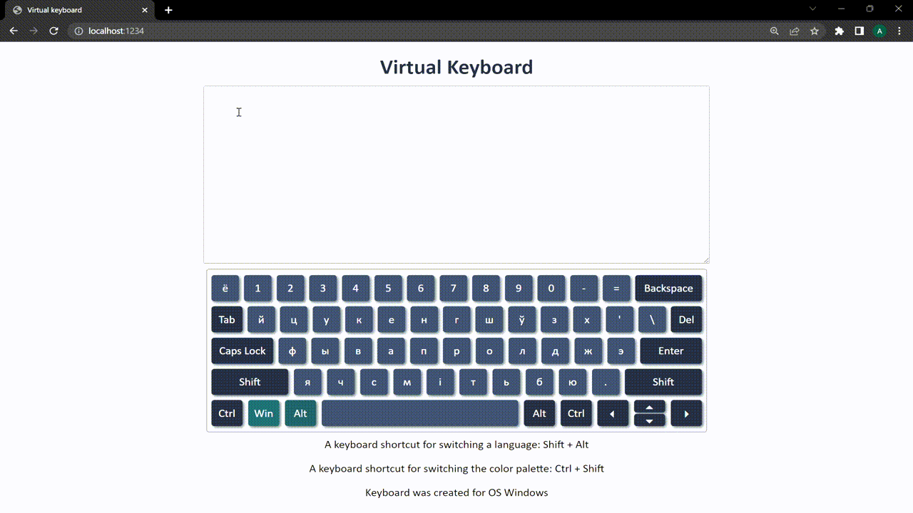

## Virtual keyboard

<kbd></kbd>

### Building a web app:

Clone repository:
```sh
    git clone https://github.com/Cheeseday/virtual-keyboard.git
```

Install dependencies:
```sh
    npm install
```

Start the application:
```sh
    npx parcel src/index.html
```
    or
```sh
    npm start
``` 

### [Here you can see implementation](https://cheeseday.github.io/virtual-keyboard/src/index.html)

### Implemented functionality:

1. Pressing a key on a physical keyboard highlights the key on the virtual keyboard;
2. Mouse clicks on buttons of the virtual keyboard or pressing buttons on a physical keyboard inputs characters to the input field;
3. Shortcut Alt + Shift switchs the keyboard language (English + Belarusian);
4. Shortcut Ctrl + Shift switchs the keyboard color palette;
5. Selected language and palette are saved and used on page after reloading.